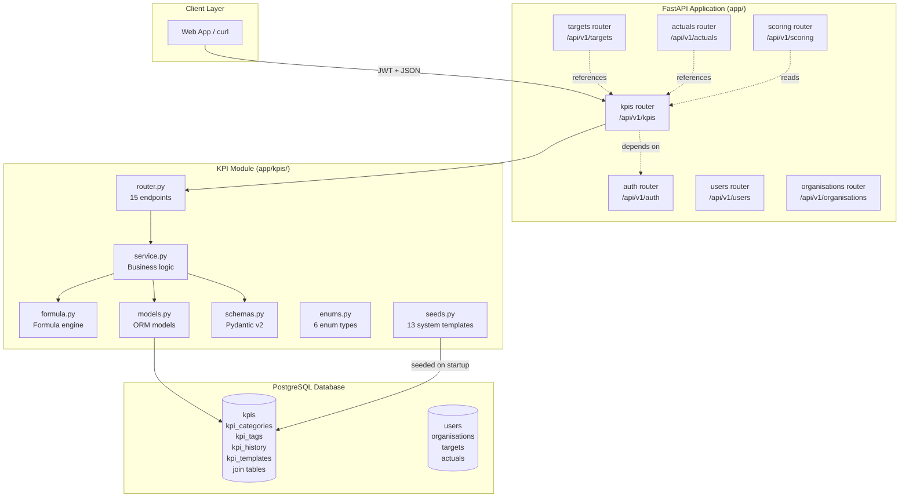
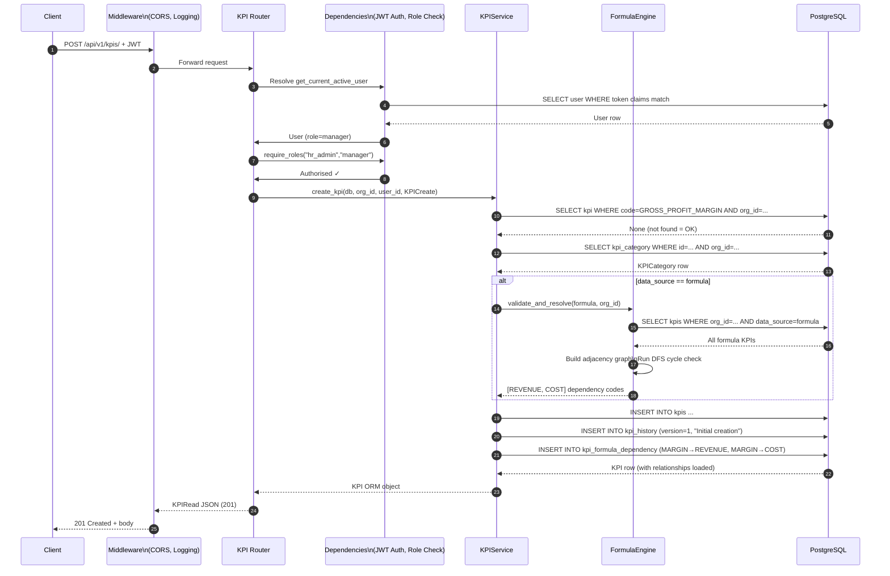
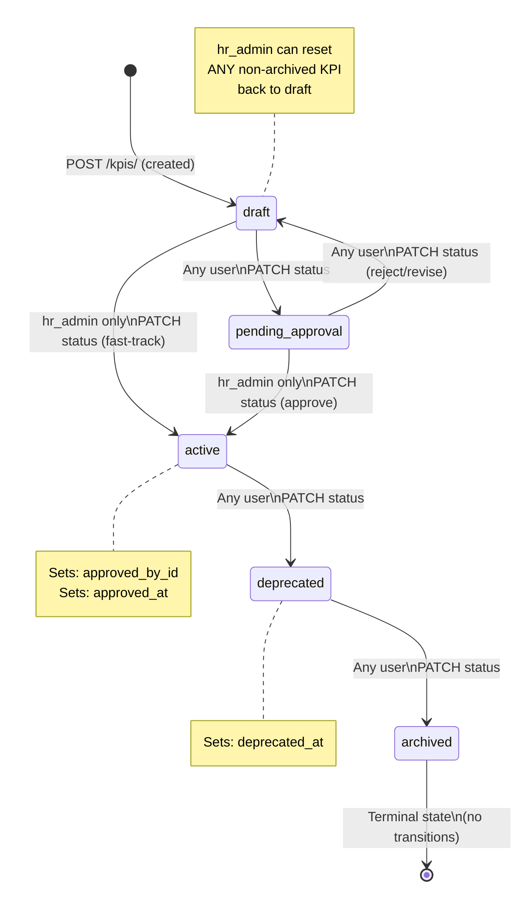
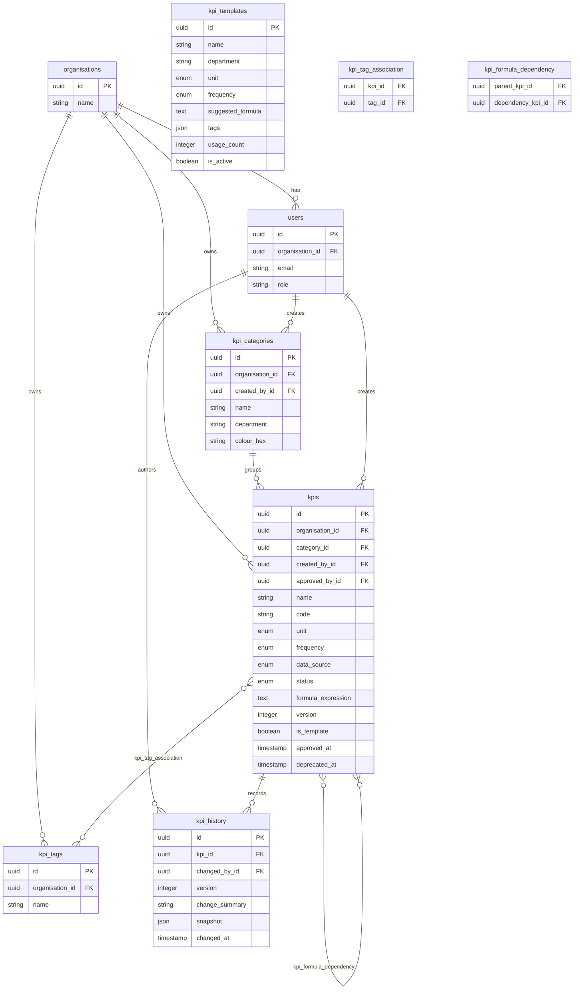
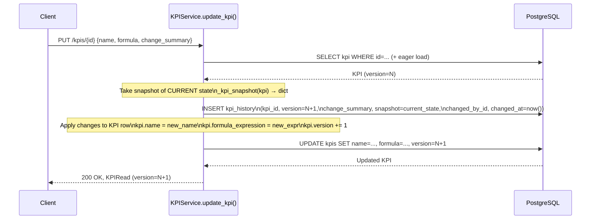
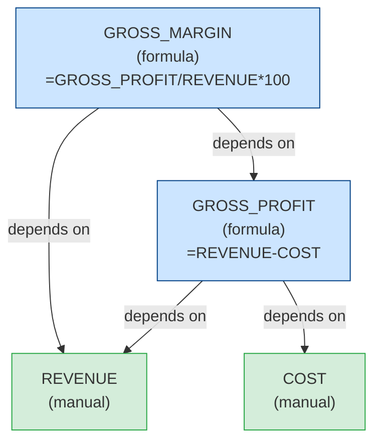
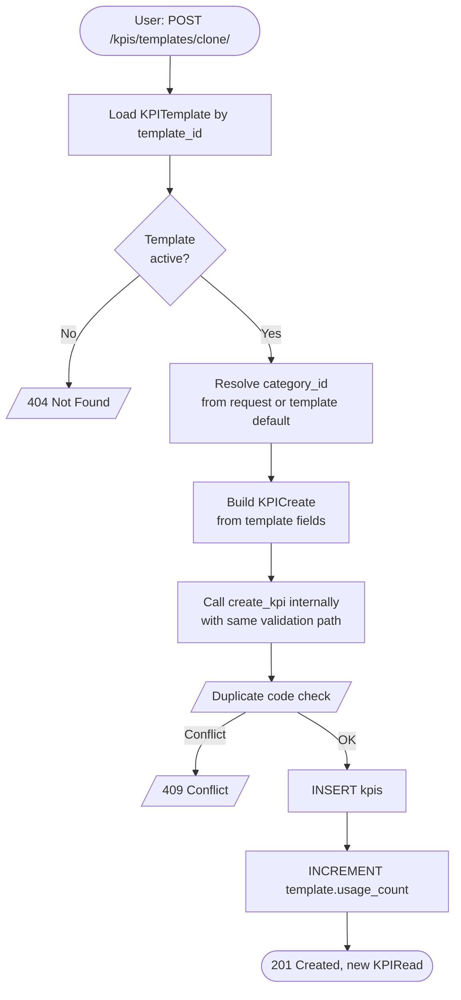

# 07 — Process Flow & Data Flow Diagrams

← [Back to Index](index.md)

---

> All diagrams use [Mermaid](https://mermaid.js.org/) syntax. They render natively in GitHub, GitLab, Notion, Obsidian, and VS Code with the Markdown Preview Mermaid Support extension.

---

## 1. System Architecture

High-level component diagram showing where the KPI module sits within the full system.



---

## 2. HTTP Request Lifecycle

Sequence diagram tracing a single `POST /kpis/` request from client to database and back.



---

## 3. Formula Validation Flow

Detailed flowchart of what happens when a formula expression is processed.

```mermaid
flowchart TD
    A([Input: formula_expression string]) --> B[Preprocess:\nReplace 'if(' with '_if_(']
    B --> C{ast.parse\nmode='eval'}
    C -->|SyntaxError| D[/"FormulaValidationError:\nInvalid syntax: ..."/]
    C -->|Success| E[Walk all AST nodes]
    E --> F{Node type in\n_SAFE_NODES?}
    F -->|No| G[/"FormulaValidationError:\nUnsafe node: ast.XXX"/]
    F -->|Yes| H{More nodes?}
    H -->|Yes| E
    H -->|No| I[Extract ast.Name nodes\nexcluding _SAFE_BUILTINS]
    I --> J[referenced_codes list]
    J --> K{Validate endpoint\nor KPI creation?}
    K -->|validate-formula endpoint| L[Query DB for each code\nin organisation]
    L --> M{All codes found?}
    M -->|No| N[/"valid=false,\nerror=KPI code not found"/]
    M -->|Yes| O[/"valid=true,\nreferenced_codes=[...]"/]
    K -->|KPI creation| P[Load all formula KPIs\nin org from DB]
    P --> Q[Build adjacency map\nfor all existing KPIs]
    Q --> R[Create _FakeKPI\nwith new KPI's code and deps]
    R --> S[Add _FakeKPI to adjacency map]
    S --> T{DFS cycle detection\nfrom new KPI's code}
    T -->|Cycle found| U[/"CircularDependencyError:\n... → ... → ..."/]
    T -->|No cycle| V{All dep codes\nexist in org?}
    V -->|Missing code| W[/NotFoundException: KPI code not found/]
    V -->|All found| X[Write kpi_formula_dependency rows\nto database]
    X --> Y([Formula validated and persisted])
```

---

## 4. KPI Status State Machine



---

## 5. Database Entity Relationship Diagram



---

## 6. KPI Creation Data Flow

End-to-end data flow for creating a formula KPI, showing how data moves through layers.

```mermaid
flowchart LR
    subgraph Input
        REQ[HTTP Request\nPOST /kpis/]
        BODY[KPICreate JSON body]
    end

    subgraph Validation["1 · Pydantic Validation (schemas.py)"]
        PV[KPICreate model_validator\nChecks formula ↔ data_source\nconsistency]
    end

    subgraph Auth["2 · Auth & Role (dependencies.py)"]
        JWT[JWT decode\nUser lookup]
        ROLE[require_roles check\nhr_admin or manager]
    end

    subgraph Service["3 · Business Logic (service.py)"]
        DUP[Duplicate code check\nSELECT WHERE org+code]
        CAT[Category existence check\nSELECT WHERE category_id+org]
        FORMULA_VAL[Formula validation\nFormulaParser + DFS]
        PERSIST[INSERT kpis\nINSERT kpi_history v1\nINSERT kpi_formula_dependency]
    end

    subgraph Response["4 · Response"]
        LOAD[Eager-load\ncategory + tags + deps]
        SCHEMA[KPIRead serialisation\nPydantic .model_validate]
        RESP[201 Created\nJSON response]
    end

    REQ --> BODY
    BODY --> PV
    PV -->|valid| JWT
    JWT --> ROLE
    ROLE -->|authorised| DUP
    DUP -->|no conflict| CAT
    CAT -->|found| FORMULA_VAL
    FORMULA_VAL -->|no cycle| PERSIST
    PERSIST --> LOAD
    LOAD --> SCHEMA
    SCHEMA --> RESP
```



---

## 7. Audit Trail Flow

How history is recorded every time a KPI definition changes.



**Key insight**: The snapshot stored in `kpi_history` is the state *before* the update. Reading `history[N]` gives you the KPI's state during version N.

---

## 8. Formula Dependency Graph (Conceptual)

How a multi-level dependency chain is represented and evaluated.



**Database representation** (rows in `kpi_formula_dependency`):

| parent_kpi_id | dependency_kpi_id |
|--------------|-----------------|
| GROSS_MARGIN.id | GROSS_PROFIT.id |
| GROSS_MARGIN.id | REVENUE.id |
| GROSS_PROFIT.id | REVENUE.id |
| GROSS_PROFIT.id | COST.id |

> Only *direct* dependencies (codes appearing literally in the formula expression) are stored. The evaluation engine resolves transitive dependencies at runtime.

---

## 9. Template Clone Workflow



---

← [Back to Index](index.md) | Previous: [06 — Tutorials](06-tutorials.md)
