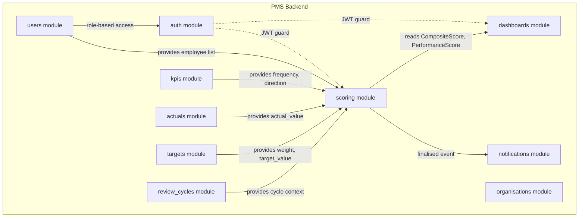
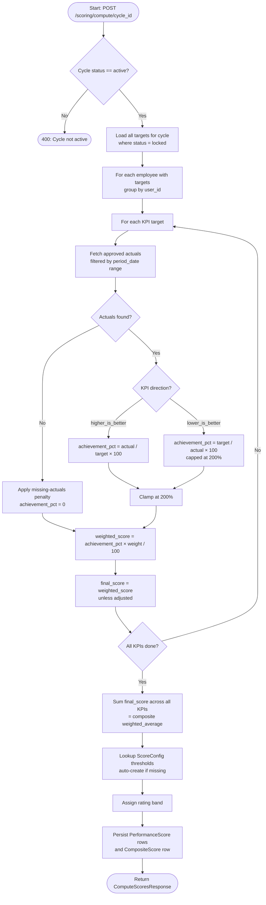
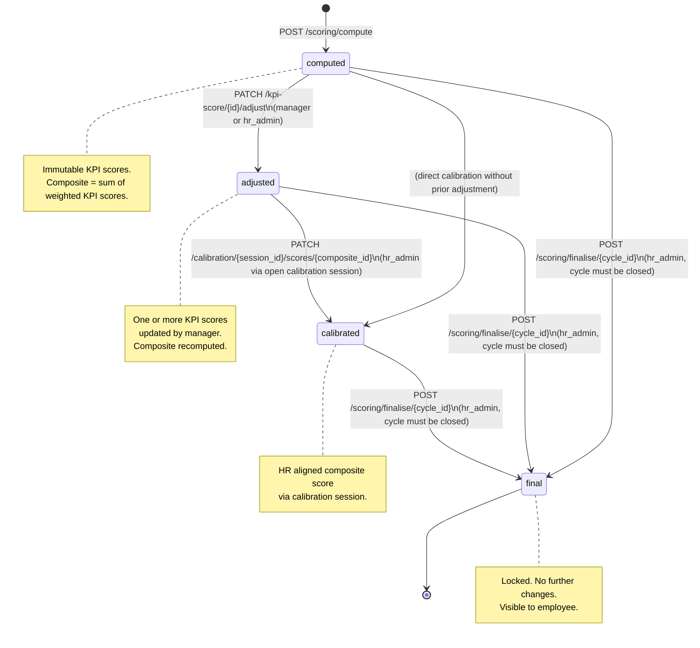
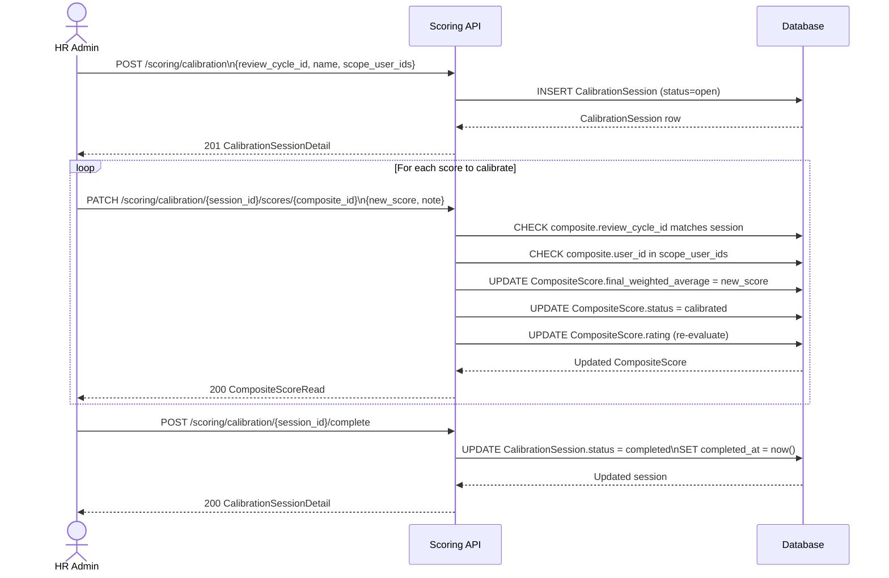
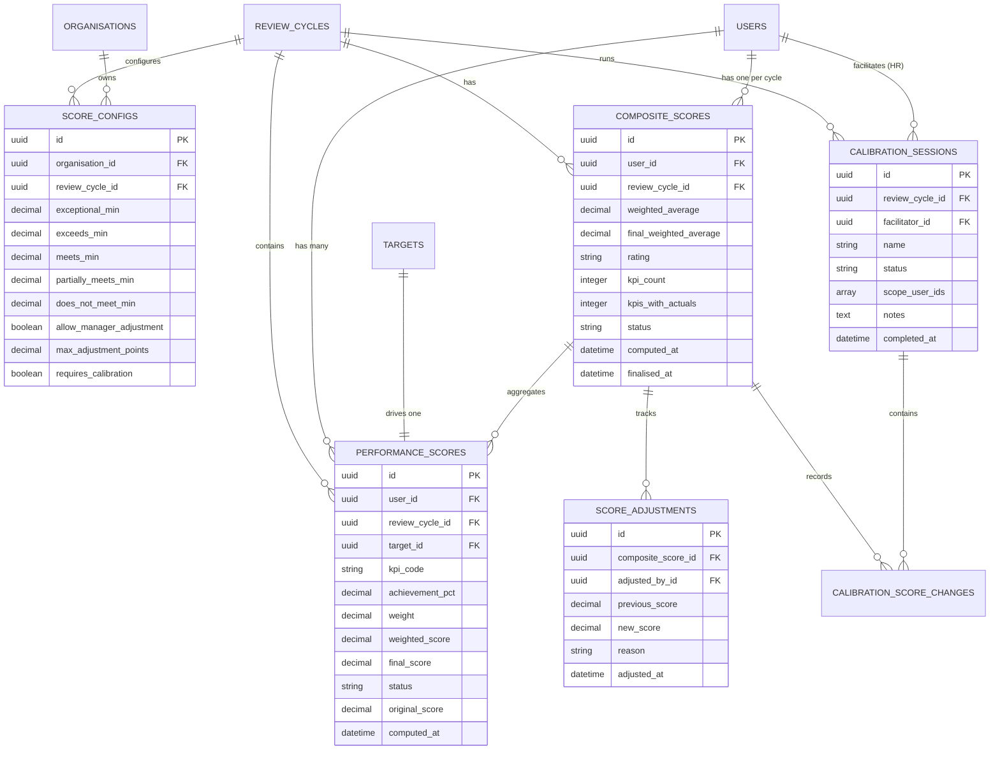
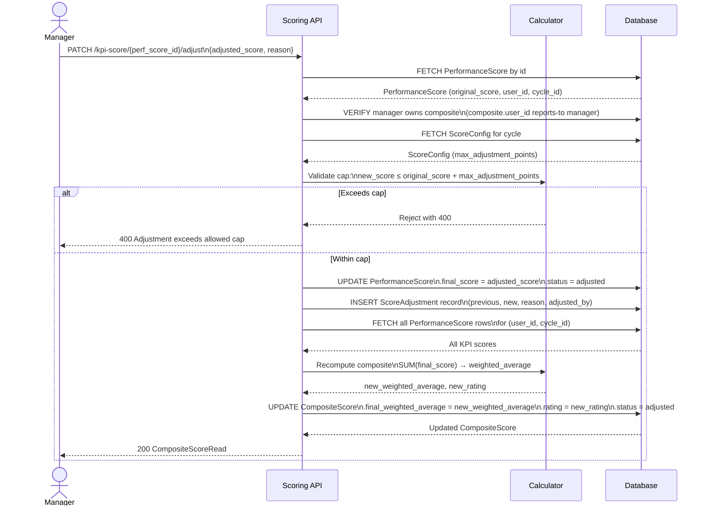
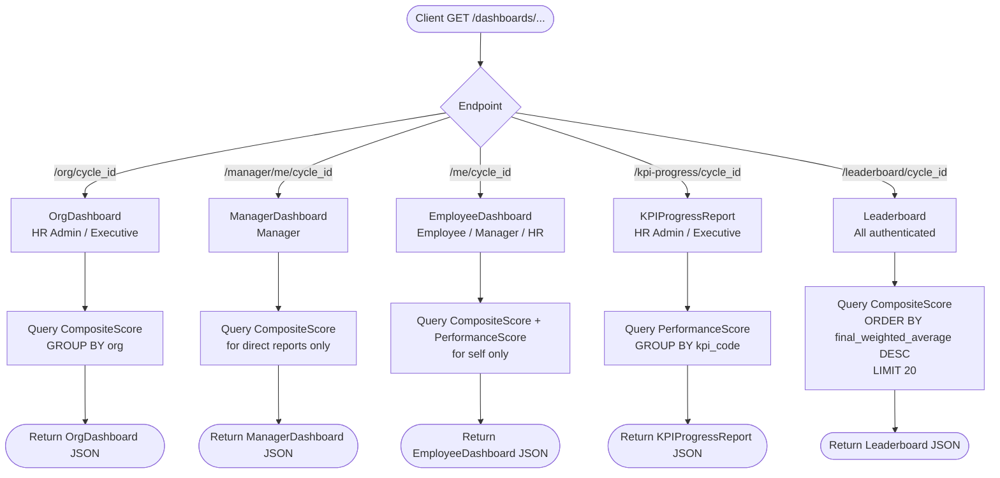

# 08 — Process Flow Diagrams

← [Back to Index](index.md)

> All diagrams use [Mermaid](https://mermaid.js.org/) syntax. Render in VS Code with the *Markdown Preview Mermaid Support* extension, or paste into [mermaid.live](https://mermaid.live/).

---

## 1. System Architecture — Module Placement

---

## 2. Scoring Engine Pipeline

---

## 3. Score Status State Machine

---

## 4. Calibration Session Lifecycle

---

## 5. Data Model Entity-Relationship Diagram

---

## 6. Manager Adjustment → Composite Recomputation

---

## 7. Dashboard Read Path

