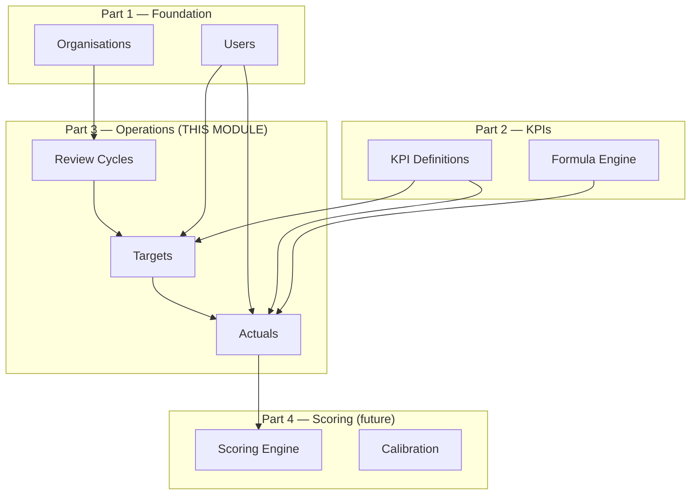
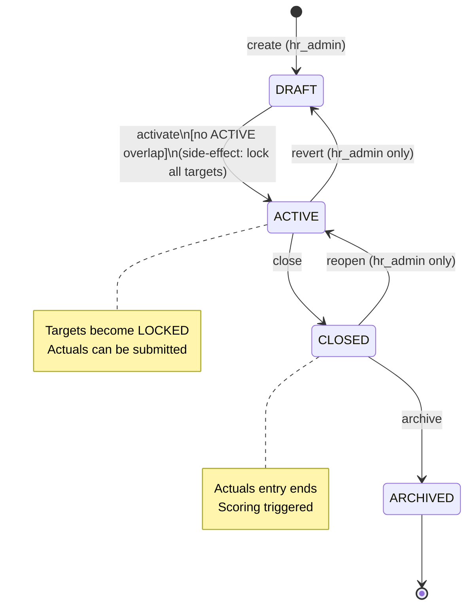
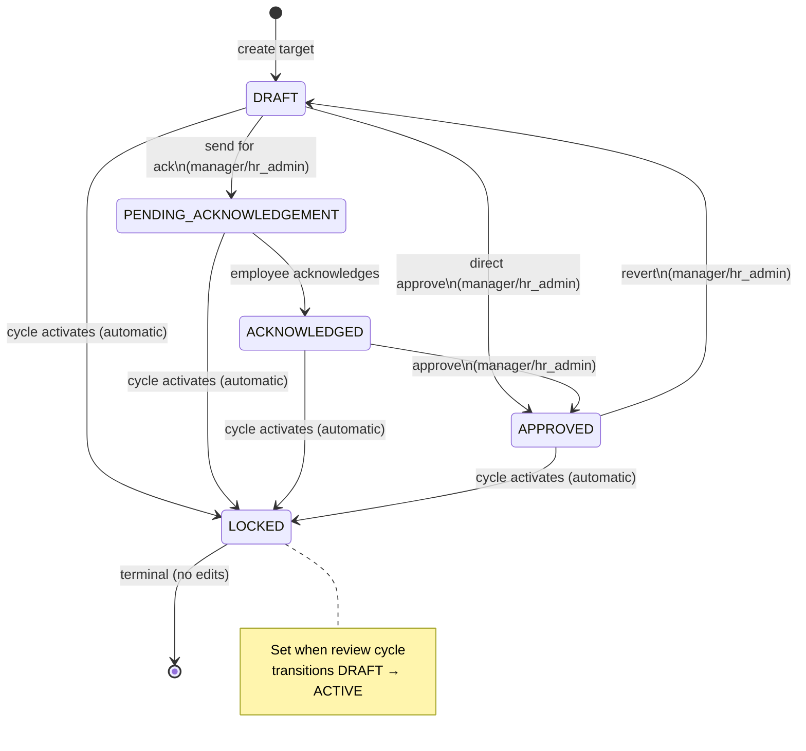
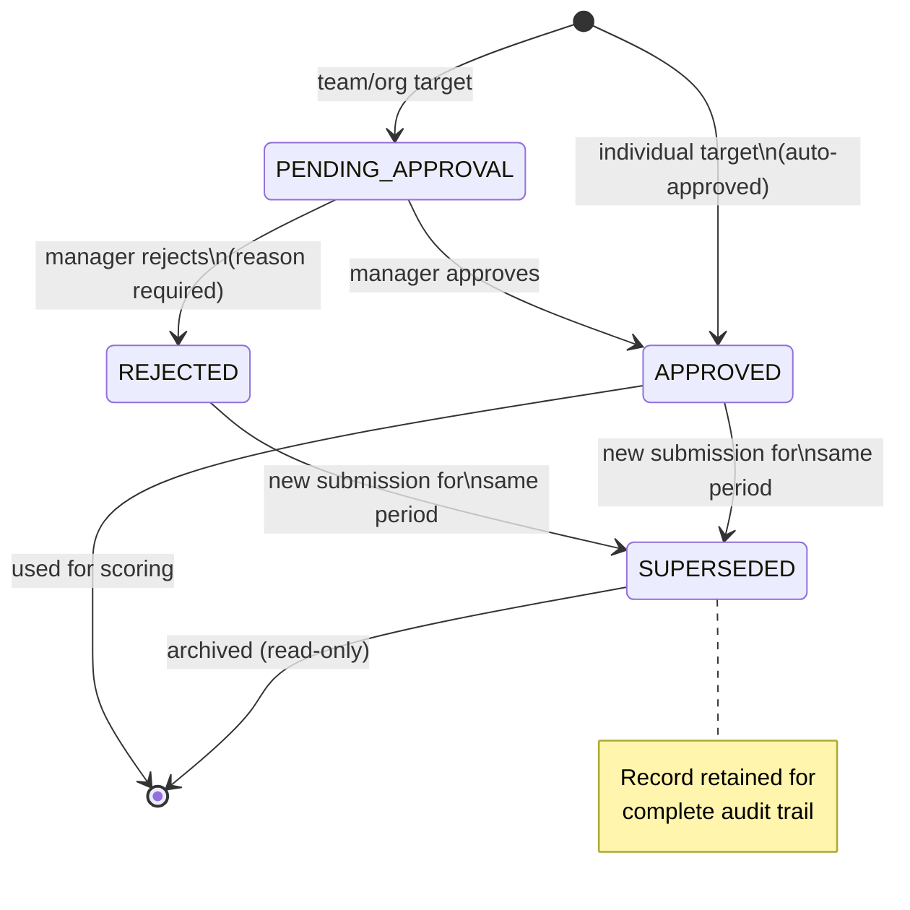
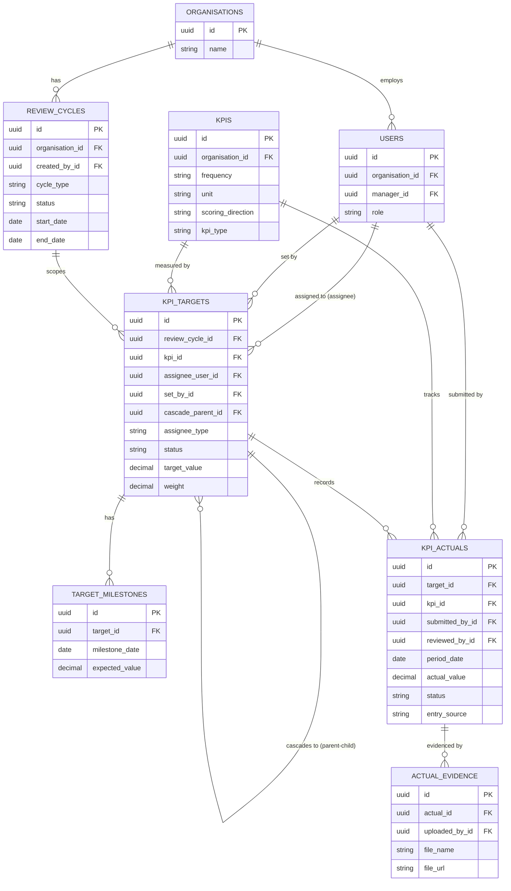
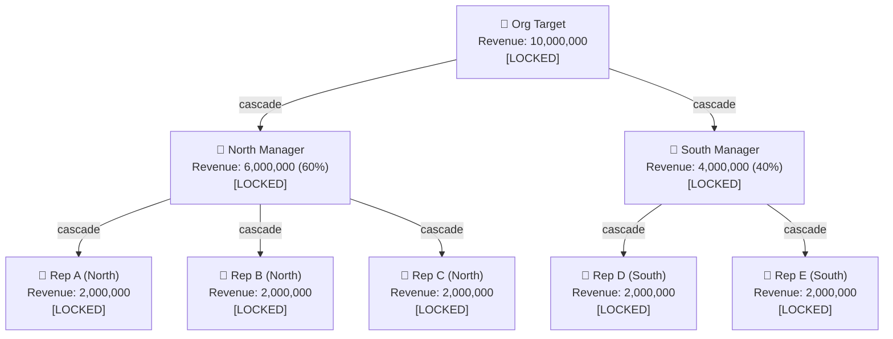
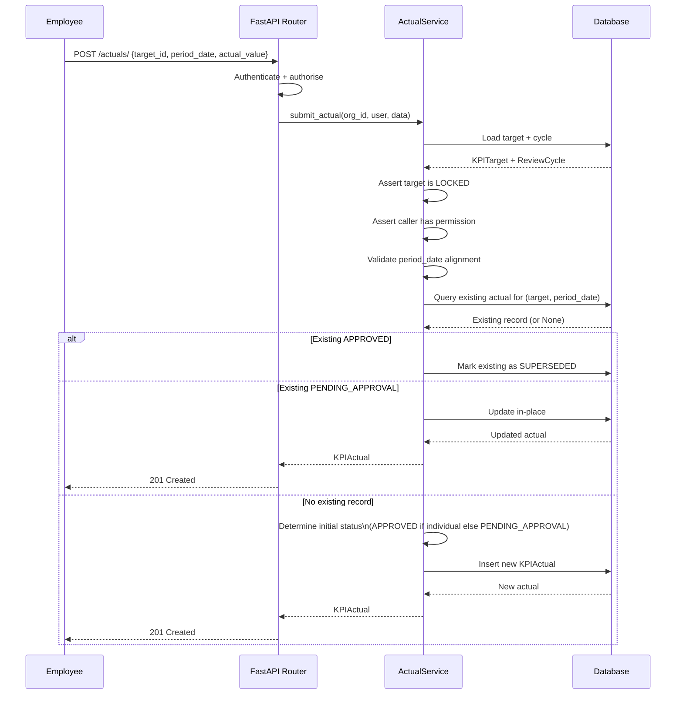
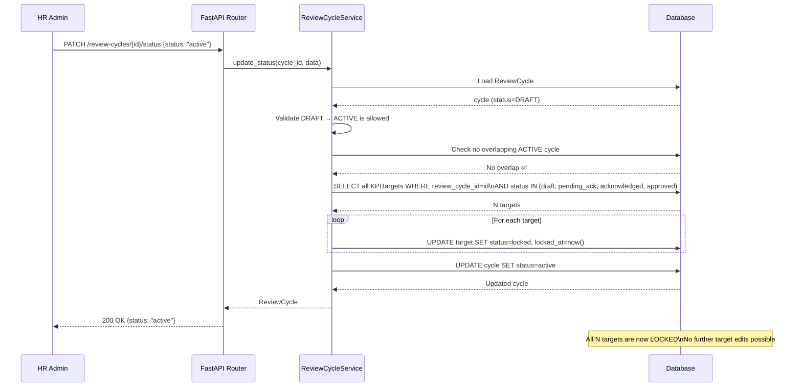
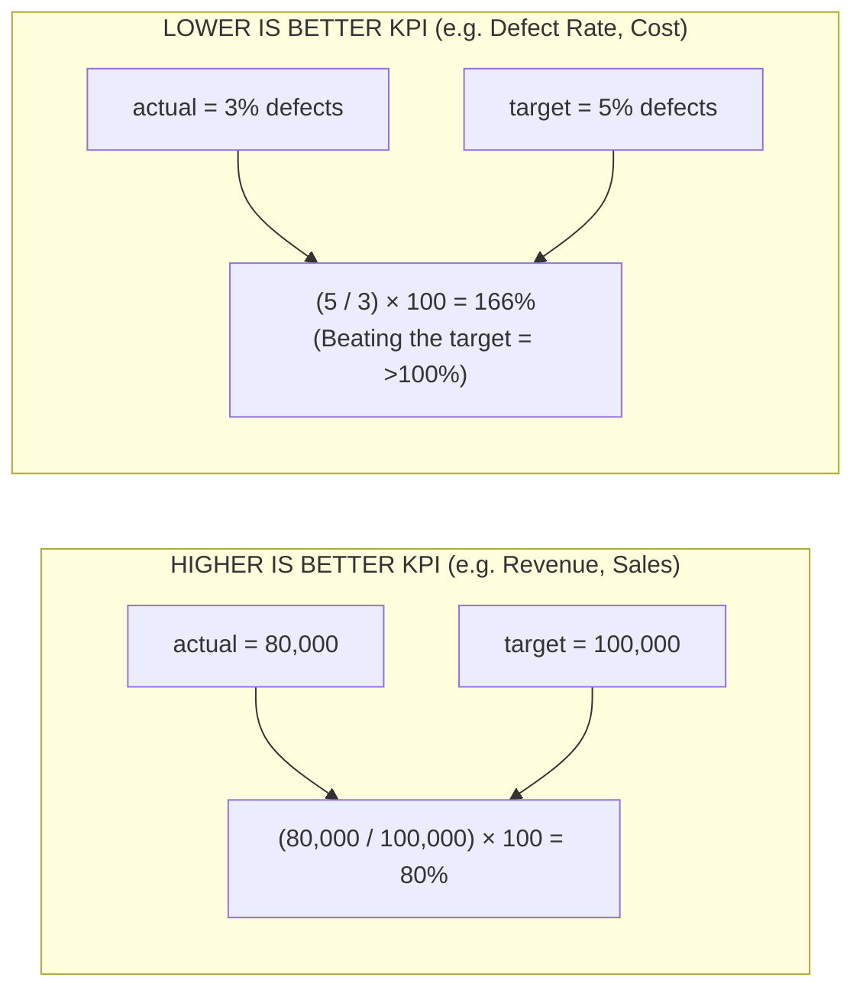
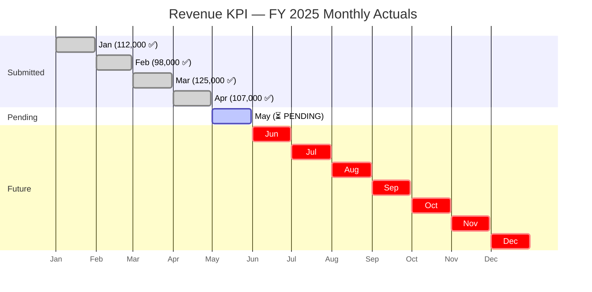

# 08 — Process & Data Flow Diagrams

> All diagrams use [Mermaid](https://mermaid.js.org/) syntax. Render them in any Markdown viewer that supports Mermaid, in the Mermaid Live Editor, or via VS Code's Mermaid extension.

---

## 1. System Context Diagram

How Part 3 fits into the overall PMS:

---

## 2. Review Cycle State Machine

---

## 3. Target Status State Machine

---

## 4. Actual Entry Status State Machine

---

## 5. Entity Relationship Diagram

---

## 6. Target Cascade Tree

Example of a 3-level cascade hierarchy (Org → Managers → Employees):

---

## 7. Actual Submission Request Flow

---

## 8. Cycle Activation Flow (Target Auto-Lock)

---

## 9. Achievement Percentage Calculations

---

## 10. Time Series Data Model

Illustrates how a 12-period annual cycle builds up over time:

